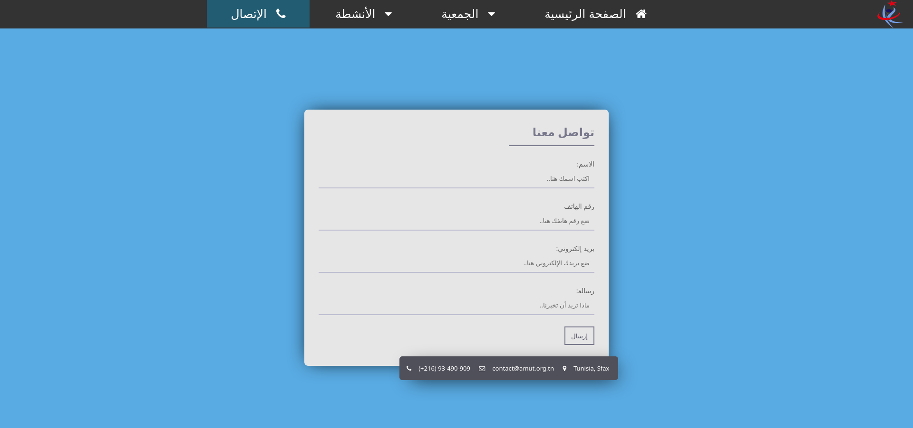

<!-- PROJECT SHIELDS -->
[](test)
[](test)
[](test)
[]()
[](LICENCE.txt)
[](https://www.linkedin.com/in/zouari-omar-143239283)

<!-- PROJECT LOGO -->
<br />
<div align="center">
  <a href="https://github.com/ZouariOmar/AMUT">
    
  </a>

<h3 align="center">AMUT</h3>

  <p align="center">
    Website project to present the AMUT charity
    <br />
    <a href="https://github.com/ZouariOmar/AMUT"><strong>Explore the docs »</strong></a>
    <br />
    <br />
    <a href="https://github.com/ZouariOmar/AMUT">View Demo</a>
    ·
    <a href="https://github.com/ZouariOmar/AMUT/issues/new?labels=bug&template=bug-report---.md">Report Bug</a>
    ·
    <a href="https://github.com/ZouariOmar/AMUT/issues/new?labels=enhancement&template=feature-request---.md">Request Feature</a>
  </p>
</div>

<!-- TABLE OF CONTENTS -->
<details>
  <summary>Table of Contents</summary>
  <ol>
    <li>
      <a href="#about-the-project">About The Project</a>
      <ul>
        <li><a href="#built-with">Built With</a></li>
      </ul>
    </li>
    <li>
      <a href="#getting-started">Getting Started</a>
      <ul>
        <li><a href="#installation">Installation</a></li>
      </ul>
    </li>
    <li><a href="#usage">Usage</a></li>
    <li><a href="#project-structure">Project Structure</a></li>
    <li><a href="#contributing">Contributing</a></li>
    <li><a href="#license">License</a></li>
    <li><a href="#contact">Contact</a></li>
    <li><a href="#acknowledgments">Acknowledgments</a></li>
  </ol>
</details>

<!-- ABOUT THE PROJECT -->

## About The Project


AMUT (Association des Médecins Unis pour la Tunisie - جمعية أطباء من أجل تونس) is a ***website project*** to present the association's initiatives, events, and contributions towards the medical field in Tunisia. The website will serve as a platform for communication, collaboration, and information dissemination among medical professionals and the general public. Key features include a **home page** with an introduction to AMUT and latest news, an **about us section** with detailed information about the association, an **events section** for upcoming and past events, and a **contact us section** with a contact form and information. The project uses `HTML`, `CSS`, `JavaScript`, `Sass` for styling, and `GitHub` for version control. For more information, you can reach out via email at [zouariomar20@gmail.com](mailto:zouariomar20@gmail.com), visit the [GitHub repository](https://github.com/ZouariOmar/AMUT), or check the LinkedIn profile at [Zouari Omar](https://www.linkedin.com/in/zouari-omar-143239283/).

<p align="right">(<a href="#readme-top">back to top</a>)</p>

## Built With

     

<p align="right">(<a href="#readme-top">back to top</a>)</p>

<!-- GETTING STARTED -->

## Getting Started

This is an example of how you may give instructions on setting up your project locally.
To get a local copy up and running follow these simple example steps.

### Installation

1. Clone the repo
   ```sh
   git clone https://github.com/ZouariOmar/AMUT.git
   ```
2. Run the home page
   ```sh
   `default-browser` AMUT/Project/html/index.html
   ```

<p align="right">(<a href="#readme-top">back to top</a>)</p>

<!-- USAGE EXAMPLES -->

## Usage

Here are some examples of how the AMUT website can be used:

### Viewing Events

Users can visit the Events section to see upcoming and past events organized by AMUT. This includes conferences, workshops, and seminars relevant to the medical community in Tunisia.


### About AMUT

The About section provides detailed information about the association, its mission, history, and its members. This section helps visitors understand the purpose and goals of AMUT.


### Accessing Activities

The activities section provides access to activities articles and other valuable resources.


### Contacting AMUT

The Contact Us section includes a form for users to get in touch with AMUT for any inquiries or collaboration opportunities. This ensures easy communication between the association and interested parties.




<p align="right">(<a href="#readme-top">back to top</a>)</p>

<!-- Project Structure -->

## Project Structure

```sh
.AMUT Project
├── AMUT.code-workspace
├── cmd
│   └── sassToCss.sh
├── github
├── pkg
│   ├── blog-card(2).zip
│   ├── responsive-contact-form
│   │   ├── dist
│   │   │   ├── form.css
│   │   │   ├── form.html
│   │   │   └── form.js
│   │   ├── license.txt
│   │   ├── README.markdown
│   │   └── src
│   │       ├── index.html
│   │       ├── script.js
│   │       └── style.css
│   ├── responsive-contact-form.zip
│   └── slider custom
│       ├── slider.css
│       ├── slider.html
│       ├── slider.js
│       └── slider.sass
├── project
│   ├── css
│   │   ├── about.css
│   │   ├── artical.css
│   │   ├── default.css
│   │   ├── footer.css
│   │   ├── form.css
│   │   ├── home.css
│   │   └── navbar.css
│   ├── doc
│   │   ├── Activités-AMUT 2021 jusqu à 2023.pptx
│   │   └── قائمة في الهيئة التسييرية لجمعية اطباء من اجل تونس لسنة 2023-2024.docx
│   ├── html
│   │   ├── activities html
│   │   │   ├── act-2021.html
│   │   │   ├── act-2022.html
│   │   │   ├── act-2023.html
│   │   │   └── act-2024.html
│   │   ├── charity html
│   │   │   ├── about_us.html
│   │   │   ├── members.html
│   │   │   ├── objectives.html
│   │   │   └── prim_law.html
│   │   ├── contact.html
│   │   └── index.html
│   ├── js
│   │   └── form.js
│   ├── res
│   │   ├── AMUT imgs
│   │   │   ├── AMUT06.png
│   │   │   ├── image.png
│   │   │   ├── logo.png
│   │   │   └── objectives.png
│   │   ├── bkg imgs
│   │   │   ├── pexels-md-sufiyan-2090648-3737018.jpg
│   │   │   └── pexels-pixabay-268415.jpg
│   │   ├── members imgs
│   │   │   └── Med_zouari.jpg
│   │   ├── screenshots
│   │   │   ├── about.png
│   │   │   ├── contact.png
│   │   │   └── home.png
│   │   ├── slider imgs
│   │   │   ├── Pasted image (10).png
│   │   │   ├── Pasted image (2).png
│   │   │   ├── Pasted image (3).png
│   │   │   ├── Pasted image (4).png
│   │   │   ├── Pasted image (5).png
│   │   │   ├── Pasted image (6).png
│   │   │   ├── Pasted image (7).png
│   │   │   ├── Pasted image (8).png
│   │   │   ├── Pasted image (9).png
│   │   │   └── Pasted image.png
│   │   ├── test.jpeg
│   │   └── vid
│   │       ├── Shiny Chrome Logo Reveal_free (online-video-cutter.com)(1).mp4
│   │       └── Shiny Chrome Logo Reveal_free (online-video-cutter.com).mp4
│   └── sass
│       ├── default.sass
│       └── home.sass
└── README.md

23 directories, 62 files
```

See the [open issues](https://github.com/ZouariOmar/AMUT/issues) for a full list of proposed features (and known issues).

<p align="right">(<a href="#readme-top">back to top</a>)</p>

<!-- CONTRIBUTING -->

## Contributing

Contributions are what make the open source community such an amazing place to learn, inspire, and create. Any contributions you make are **greatly appreciated**.

If you have a suggestion that would make this better, please fork the repo and create a pull request. You can also simply open an issue with the tag "enhancement".
Don't forget to give the project a star! Thanks again!

1. Fork the Project
2. Create your Feature Branch (`git checkout -b feature/AmazingFeature`)
3. Commit your Changes (`git commit -m 'Add some AmazingFeature'`)
4. Push to the Branch (`git push origin feature/AmazingFeature`)
5. Open a Pull Request

<p align="right">(<a href="#readme-top">back to top</a>)</p>

<!-- LICENSE -->

## License

This project is licensed under the MIT License - see the [LICENSE](/ZouariOmar/AMUT/blob/main/LICENSE) file for details.

<p align="right">(<a href="#readme-top">back to top</a>)</p>

<!-- CONTACT -->

## Contact

If you have any questions or suggestions, please feel free to reach out to us at [zouariomar20@gmail.com](mailto:zouariomar20@gmail.com)

Project Link: [https://github.com/ZouariOmar/AMUT](https://github.com/ZouariOmar/AMUT)

<p align="right">(<a href="#readme-top">back to top</a>)</p>

<!-- ACKNOWLEDGMENTS -->

## Acknowledgments

- [AMUT](https://www.facebook.com/AMUT2012)

<p align="right">(<a href="#readme-top">back to top</a>)</p>
